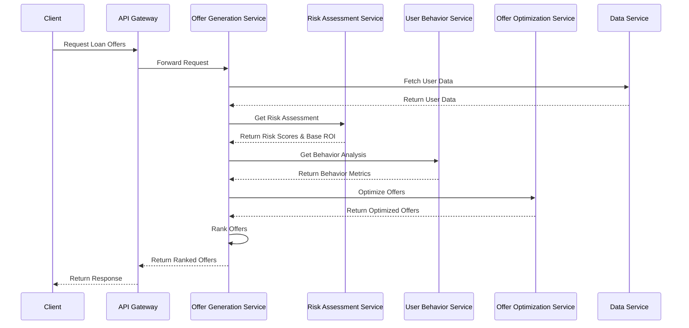
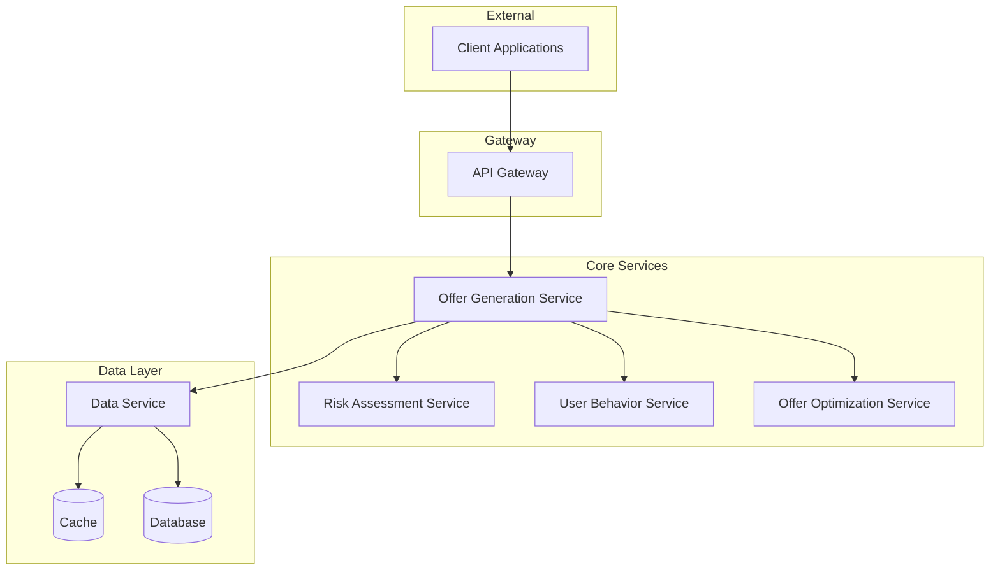
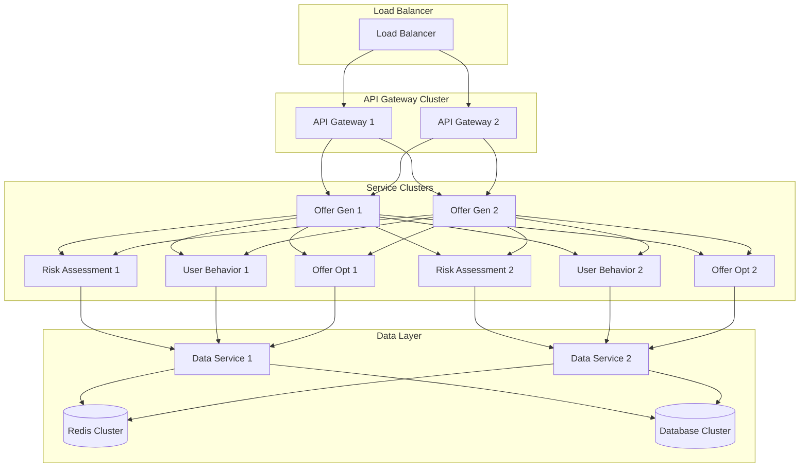

# Dynamic Loan Offer Generation System - High Level Architecture

## 1. System Overview

The Dynamic Loan Offer Generation System is designed to generate and rank personalized loan offers for users based on their risk profile, behavior metrics, and business rules. The system follows a microservices architecture pattern to ensure scalability, maintainability, and high performance.

## 2. Core Components

### 2.1 API Gateway
**Responsibilities:**
- Entry point for all external requests
- Request routing and load balancing
- Authentication and authorization
- Rate limiting and request throttling
- Request/Response transformation

### 2.2 Offer Generation Service
**Responsibilities:**
- Orchestrates the offer generation process
- Manages the flow of data between components
- Implements business rules for offer generation
- Handles offer ranking and optimization
- Returns ranked list of offers

### 2.3 Risk Assessment Service
**Responsibilities:**
- Calculates risk scores based on user parameters
- Determines base ROI and acceptable ranges
- Evaluates risk thresholds and constraints
- Provides risk-based recommendations

### 2.4 User Behavior Service
**Responsibilities:**
- Analyzes user behavior patterns
- Calculates price sensitivity scores
- Determines conversion probabilities
- Evaluates long-term value metrics

### 2.5 Offer Optimization Service
**Responsibilities:**
- Applies ROI adjustment rules
- Implements value preservation rules
- Handles fallback scenarios
- Optimizes offers based on constraints

### 2.6 Data Service
**Responsibilities:**
- Manages data access and persistence
- Handles data caching
- Provides data aggregation capabilities
- Manages historical data

## 3. Component Interaction Flow



## 4. Component Architecture



## 5. Data Flow

1. **Request Flow:**
   - Client sends request to API Gateway
   - API Gateway validates and routes request to Offer Generation Service
   - Offer Generation Service orchestrates the offer generation process

2. **Risk Assessment Flow:**
   - Risk Assessment Service receives user data
   - Calculates risk scores and base ROI
   - Returns risk assessment results

3. **Behavior Analysis Flow:**
   - User Behavior Service analyzes user data
   - Calculates behavior metrics
   - Returns behavior analysis results

4. **Offer Optimization Flow:**
   - Offer Optimization Service receives risk and behavior data
   - Applies optimization rules
   - Returns optimized offers

5. **Response Flow:**
   - Offer Generation Service ranks offers
   - Returns ranked list through API Gateway
   - Client receives response

## 6. Key Interfaces

### 6.1 API Gateway Interface
```typescript
interface LoanOfferRequest {
    userId: string;
    requestedAmount?: number;
    requestedTenure?: number;
}

interface LoanOfferResponse {
    offers: Array<{
        offerId: string;
        roi: number;
        amount: number;
        tenure: number;
        processingFee: number;
        rank: number;
        conversionProbability: number;
    }>;
}
```

### 6.2 Service Interfaces
```typescript
interface RiskAssessmentResult {
    riskScore: number;
    baseROI: number;
    minROI: number;
    maxROI: number;
    riskRange: number;
}

interface BehaviorAnalysisResult {
    priceSensitivity: 'LOW' | 'MEDIUM' | 'HIGH';
    conversionProbability: number;
    longTermValue: number;
}

interface OptimizedOffer {
    roi: number;
    amount: number;
    tenure: number;
    processingFee: number;
    riskImpact: number;
    conversionProbability: number;
}
```

## 7. Non-Functional Requirements

### 7.1 Performance
- API response time < 2 seconds
- Support for 1000+ concurrent requests
- 99.9% system availability

### 7.2 Scalability
- Horizontal scaling of services
- Distributed caching
- Load balancing

### 7.3 Security
- End-to-end encryption
- Role-based access control
- Audit logging
- Data encryption at rest

### 7.4 Monitoring
- Real-time service health monitoring
- Performance metrics tracking
- Error rate monitoring
- Business metrics tracking

## 8. Deployment Architecture

