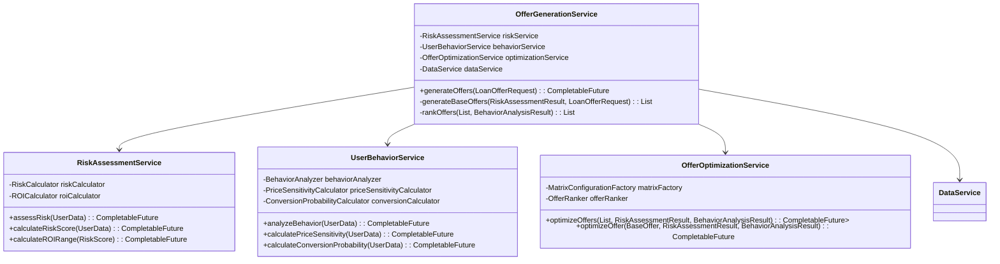
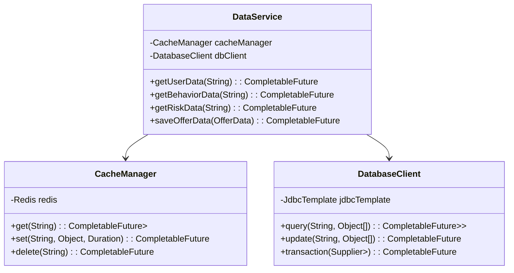
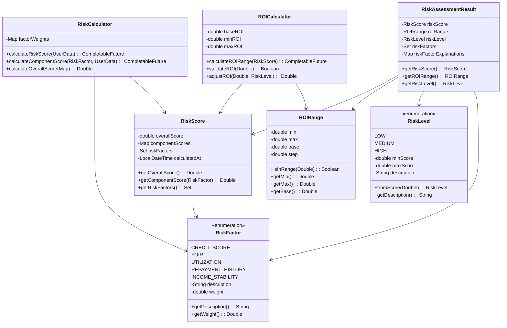
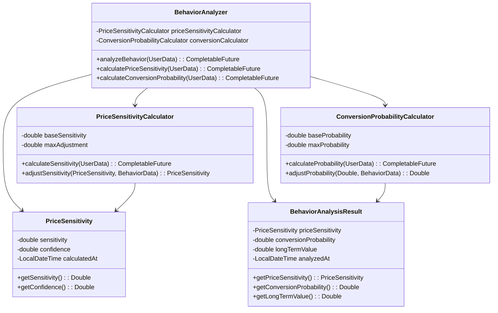
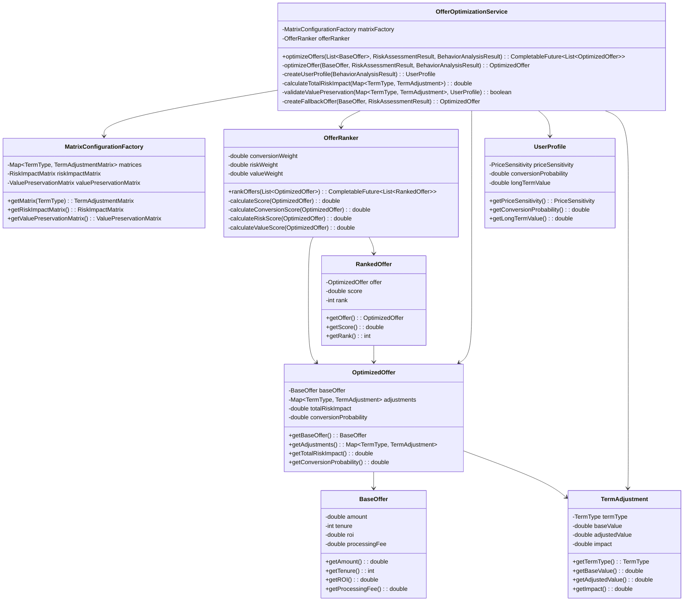
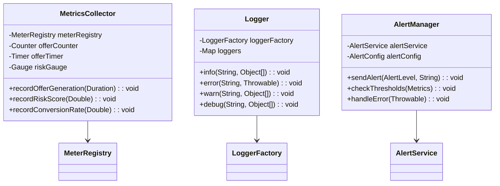
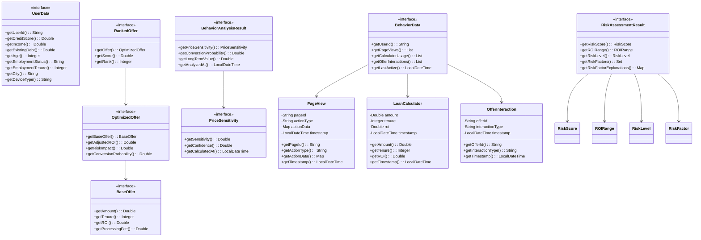

# Dynamic Loan Offer Generation System - Low Level Design

## 1. System Overview and Class Diagrams

### 1.1 Core Service Class Diagram
The core service layer orchestrates the entire loan offer generation process. It coordinates between different services and manages the flow of data.

**Key Components:**
- `OfferGenerationService`: Main orchestrator that:
  - Validates incoming requests
  - Manages rate limiting
  - Coordinates between risk assessment, behavior analysis, and optimization
  - Handles offer ranking and response generation
- `RiskAssessmentService`: Evaluates user risk profile by:
  - Calculating risk scores
  - Determining base ROI ranges
  - Assessing risk thresholds
- `UserBehaviorService`: Analyzes user behavior patterns to:
  - Calculate price sensitivity
  - Determine conversion probabilities
  - Evaluate long-term value
- `OfferOptimizationService`: Optimizes loan offers by:
  - Applying matrix-based adjustments
  - Managing risk impacts
  - Ensuring value preservation



### 1.2 Data Service Class Diagram
The data service layer manages all data access and persistence operations. It provides a unified interface for data operations across the system.

**Key Components:**
- `DataService`: Central data access point that:
  - Manages user data retrieval
  - Handles behavior data access
  - Controls risk data operations
  - Manages offer data persistence
- `CacheManager`: Optimizes performance through:
  - Redis-based caching
  - Cache key management
  - Cache invalidation
- `DatabaseClient`: Handles database operations:
  - Query execution
  - Transaction management
  - Data updates



### 1.3 Risk Assessment Class Diagram
The risk assessment layer evaluates user risk profiles and determines appropriate risk parameters for loan offers.

**Key Components:**
- `RiskCalculator`: Core risk evaluation engine that:
  - Calculates component risk scores
  - Applies risk factor weights
  - Computes overall risk scores
- `ROICalculator`: Manages ROI calculations:
  - Determines base ROI
  - Calculates ROI ranges
  - Validates ROI adjustments
- `RiskScore`: Represents risk assessment results:
  - Overall risk score
  - Component scores
  - Risk factors
- `RiskLevel`: Categorizes risk levels:
  - Risk thresholds
  - Level descriptions
  - Risk categorization



### 1.4 Behavior Analysis Class Diagram
The behavior analysis layer evaluates user behavior patterns to optimize offer generation.

**Key Components:**
- `BehaviorAnalyzer`: Main behavior analysis engine that:
  - Coordinates behavior analysis
  - Integrates various behavior metrics
  - Generates behavior insights
- `PriceSensitivityCalculator`: Evaluates price sensitivity:
  - Calculates sensitivity scores
  - Determines confidence levels
  - Tracks sensitivity trends
- `ConversionProbabilityCalculator`: Predicts offer acceptance:
  - Calculates conversion likelihood
  - Factors in user behavior
  - Updates probability models



### 1.5 Offer Optimization Service Class Diagram
The offer optimization service is responsible for generating and optimizing loan offers based on risk assessment, user behavior, and business rules. It uses configurable matrices to adjust various loan terms while maintaining risk and value constraints.

**Key Components:**
- `OfferOptimizationService`: Main optimization orchestrator that:
  - Coordinates the optimization process
  - Manages term adjustments
  - Handles offer ranking
  - Ensures constraint compliance
- `MatrixConfigurationFactory`: Manages all optimization matrices:
  - Term-specific matrices (ROI, Processing Fee, Tenure)
  - Risk impact matrices
  - Value preservation rules
- `OfferRanker`: Ranks optimized offers based on:
  - Conversion probability
  - Risk-adjusted return
  - Long-term value
  - Business objectives

**Optimization Flow:**
1. Receives base offers and user profile
2. Applies term-specific adjustments using matrices
3. Calculates and validates risk impacts
4. Ensures value preservation
5. Ranks final offers



**Component Interactions:**
1. `OfferOptimizationService` uses `MatrixConfigurationFactory` to:
   - Get term-specific matrices for adjustments
   - Access risk impact calculations
   - Validate value preservation rules

2. `OfferRanker` evaluates offers based on:
   - Conversion probability from user profile
   - Risk impact from adjustments
   - Long-term value potential
   - Business objectives

3. `OptimizedOffer` contains:
   - Original base offer
   - Term-specific adjustments
   - Total risk impact
   - Conversion probability

4. `RankedOffer` represents the final output with:
   - Optimized offer details
   - Calculated score
   - Rank position

**Optimization Process:**
1. **Initialization:**
   - Create user profile from behavior analysis
   - Load relevant matrices from factory

2. **Term Adjustment:**
   - Apply ROI adjustments
   - Adjust processing fees
   - Modify tenure options
   - Validate all adjustments

3. **Risk Assessment:**
   - Calculate individual term impacts
   - Compute total risk impact
   - Validate against thresholds

4. **Value Preservation:**
   - Check against preservation rules
   - Apply fallback if needed
   - Ensure business objectives

5. **Final Ranking:**
   - Calculate offer scores
   - Apply ranking algorithm
   - Return ranked offers

### 1.6 Matrix Configuration Class Diagram
The matrix configuration layer provides a flexible and extensible framework for managing loan term adjustments. It implements the business rules defined in the TRD as configurable matrices.

**Key Components:**
- `TermAdjustmentMatrix`: Base interface for all term-specific matrices that:
  - Defines common adjustment operations
  - Ensures consistent validation
  - Provides constraint management
- `ROIMatrix`: Manages ROI adjustments with:
  - Base ROI determination
  - Min/Max ROI constraints
  - Risk-based range calculations
- `ProcessingFeeMatrix`: Handles processing fee adjustments with:
  - Base fee calculations
  - Fee range constraints
  - User profile-based adjustments
- `TenureMatrix`: Manages loan tenure options with:
  - Available tenure list
  - Profile-based tenure adjustments
  - Tenure validation rules
- `RiskImpactMatrix`: Tracks risk impacts across all terms:
  - Term-specific impact calculations
  - Maximum impact thresholds
  - Impact validation rules
- `ValuePreservationMatrix`: Ensures business value preservation:
  - Term-specific preservation rules
  - Rule validation
  - Value threshold management

```mermaid
classDiagram
    class TermAdjustmentMatrix {
        <<interface>>
        +getAdjustment(TermType, UserProfile): TermAdjustment
        +validateAdjustment(TermAdjustment): boolean
        +getConstraints(): TermConstraints
    }

    class ROIMatrix {
        -double baseROI
        -double minROI
        -double maxROI
        -double riskRange
        -Map<UserProfile, ROIAdjustment> adjustments
        +getAdjustment(UserProfile): ROIAdjustment
        +validateAdjustment(ROIAdjustment): boolean
        +getConstraints(): ROIConstraints
    }

    class ProcessingFeeMatrix {
        -double baseFee
        -double minFee
        -double maxFee
        -Map<UserProfile, FeeAdjustment> adjustments
        +getAdjustment(UserProfile): FeeAdjustment
        +validateAdjustment(FeeAdjustment): boolean
        +getConstraints(): FeeConstraints
    }

    class TenureMatrix {
        -List<Integer> availableTenures
        -Map<UserProfile, TenureAdjustment> adjustments
        +getAdjustment(UserProfile): TenureAdjustment
        +validateAdjustment(TenureAdjustment): boolean
        +getConstraints(): TenureConstraints
    }

    class RiskImpactMatrix {
        -Map<TermType, RiskImpact> impacts
        -Map<TermType, Double> maxAllowedImpacts
        +getImpact(TermType, double): RiskImpact
        +validateImpact(RiskImpact): boolean
        +getMaxAllowedImpact(TermType): double
    }

    class ValuePreservationMatrix {
        -Map<TermType, ValuePreservationRules> rules
        +getRules(TermType): ValuePreservationRules
        +validateRules(ValuePreservationRules): boolean
    }

    class UserProfile {
        -PriceSensitivity priceSensitivity
        -double conversionProbability
        -double longTermValue
        +getPriceSensitivity(): PriceSensitivity
        +getConversionProbability(): double
        +getLongTermValue(): double
    }

    class TermAdjustment {
        -TermType termType
        -double baseValue
        -double adjustedValue
        -double impact
        +getTermType(): TermType
        +getBaseValue(): double
        +getAdjustedValue(): double
        +getImpact(): double
    }

    class TermConstraints {
        -double minValue
        -double maxValue
        -double baseValue
        -double adjustmentRange
        +getMinValue(): double
        +getMaxValue(): double
        +getBaseValue(): double
        +getAdjustmentRange(): double
    }

    class TermType {
        <<enumeration>>
        ROI
        PROCESSING_FEE
        TENURE
        LOAN_AMOUNT
    }

    TermAdjustmentMatrix <|.. ROIMatrix
    TermAdjustmentMatrix <|.. ProcessingFeeMatrix
    TermAdjustmentMatrix <|.. TenureMatrix
    TermAdjustmentMatrix --> UserProfile
    TermAdjustmentMatrix --> TermAdjustment
    TermAdjustmentMatrix --> TermConstraints
    TermAdjustmentMatrix --> TermType
    RiskImpactMatrix --> TermType
    ValuePreservationMatrix --> TermType
```



### 1.7 Monitoring and Logging Class Diagram
The monitoring and logging layer ensures system observability and maintains audit trails.

**Key Components:**
- `MetricsCollector`: Tracks system metrics:
  - Offer generation metrics
  - Risk score tracking
  - Conversion rate monitoring
- `Logger`: Manages system logging:
  - Log level management
  - Log formatting
  - Log distribution
- `AlertManager`: Handles system alerts:
  - Threshold monitoring
  - Alert generation
  - Alert distribution



### 1.8 Data Model Class Diagram
The data model layer defines the core data structures used throughout the system. These models represent the business entities and their relationships.

**Key Components:**
- `UserData`: Core user information
- `BehaviorData`: User behavior tracking
- `BaseOffer`: Initial loan offer structure
- `OptimizedOffer`: Enhanced offer with adjustments
- `RankedOffer`: Final ranked offer
- `RiskAssessmentResult`: Risk evaluation results
- `BehaviorAnalysisResult`: Behavior analysis results
- `PriceSensitivity`: Price sensitivity metrics



## 2. Project Structure

### 2.1 Directory Layout
```
loan-offer-generation/
├── src/
│   ├── main/
│   │   ├── java/
│   │   │   └── com/
│   │   │       └── cred/
│   │   │           └── loan/
│   │   │               ├── LoanOfferApplication.java
│   │   │               ├── config/
│   │   │               │   ├── CacheConfig.java
│   │   │               │   ├── MetricsConfig.java
│   │   │               │   └── LoggingConfig.java
│   │   │               ├── core/
│   │   │               │   ├── service/
│   │   │               │   │   ├── OfferGenerationService.java
│   │   │               │   │   ├── RiskAssessmentService.java
│   │   │               │   │   ├── UserBehaviorService.java
│   │   │               │   │   └── OfferOptimizationService.java
│   │   │               │   ├── model/
│   │   │               │   │   ├── UserData.java
│   │   │               │   │   ├── BehaviorData.java
│   │   │               │   │   ├── BaseOffer.java
│   │   │               │   │   ├── OptimizedOffer.java
│   │   │               │   │   ├── RankedOffer.java
│   │   │               │   │   ├── LoanOfferRequest.java
│   │   │               │   │   └── LoanOfferResponse.java
│   │   │               │   └── exception/
│   │   │               │       ├── RiskAssessmentException.java
│   │   │               │       └── OptimizationException.java
│   │   │               ├── data/
│   │   │               │   ├── service/
│   │   │               │   │   ├── DataService.java
│   │   │               │   │   ├── CacheManager.java
│   │   │               │   │   └── DatabaseClient.java
│   │   │               │   └── repository/
│   │   │               │       ├── UserRepository.java
│   │   │               │       ├── BehaviorRepository.java
│   │   │               │       └── OfferRepository.java
│   │   │               ├── risk/
│   │   │               │   ├── calculator/
│   │   │               │   │   ├── RiskCalculator.java
│   │   │               │   │   └── ROICalculator.java
│   │   │               │   └── model/
│   │   │               │       ├── RiskScore.java
│   │   │               │       ├── ROIRange.java
│   │   │               │       ├── RiskLevel.java
│   │   │               │       ├── RiskFactor.java
│   │   │               │       └── RiskImpact.java
│   │   │               ├── behavior/
│   │   │               │   ├── analyzer/
│   │   │               │   │   ├── BehaviorAnalyzer.java
│   │   │               │   │   ├── PriceSensitivityCalculator.java
│   │   │               │   │   └── ConversionProbabilityCalculator.java
│   │   │               │   └── model/
│   │   │               │       ├── PriceSensitivity.java
│   │   │               │       └── BehaviorAnalysisResult.java
│   │   │               ├── optimization/
│   │   │               │   ├── service/
│   │   │               │   │   ├── OfferOptimizer.java
│   │   │               │   │   └── OfferRanker.java
│   │   │               │   ├── matrix/
│   │   │               │   │   ├── TermAdjustmentMatrix.java
│   │   │               │   │   ├── ROIMatrix.java
│   │   │               │   │   ├── ProcessingFeeMatrix.java
│   │   │               │   │   ├── RiskImpactMatrix.java
│   │   │               │   │   ├── ValuePreservationMatrix.java
│   │   │               │   │   └── ValuePreservationRules.java
│   │   │               │   └── model/
│   │   │               │       ├── UserProfile.java
│   │   │               │       ├── TermType.java
│   │   │               │       └── TermConstraints.java
│   │   │               └── monitoring/
│   │   │                   ├── MetricsCollector.java
│   │   │                   ├── Logger.java
│   │   │                   └── AlertManager.java
│   │   └── resources/
│   │       ├── application.yml
│   │       ├── application-dev.yml
│   │       └── application-prod.yml
│   └── test/
│       └── java/
│           └── com/
│               └── cred/
│                   └── loan/
│                       ├── core/
│                       ├── data/
│                       ├── risk/
│                       ├── behavior/
│                       └── optimization/
├── docs/
│   ├── loan_offer_generation_lld.md
│   └── api/
│       └── swagger.yaml
├── scripts/
│   ├── setup.sh
│   └── deploy.sh
├── .gitignore
├── pom.xml
└── README.md
```

### 2.2 Key Package Descriptions

#### 2.2.1 Core Package (`com.cred.loan.core`)
- Contains the main service interfaces and implementations
- Houses core domain models and exceptions
- Defines the primary business logic and workflows

#### 2.2.2 Data Package (`com.cred.loan.data`)
- Manages all data access and persistence operations
- Implements caching strategies
- Handles database interactions and transactions

#### 2.2.3 Risk Package (`com.cred.loan.risk`)
- Implements risk assessment algorithms
- Manages risk score calculations
- Handles ROI range determinations

#### 2.2.4 Behavior Package (`com.cred.loan.behavior`)
- Analyzes user behavior patterns
- Calculates price sensitivity
- Determines conversion probabilities

#### 2.2.5 Optimization Package (`com.cred.loan.optimization`)
- Implements offer optimization logic
- Manages matrix-based adjustments
- Handles offer ranking algorithms

#### 2.2.6 Monitoring Package (`com.cred.loan.monitoring`)
- Collects system metrics
- Manages logging
- Handles alert generation and distribution

### 2.3 Configuration Files
- `application.yml`: Main application configuration
- `application-dev.yml`: Development environment specific settings
- `application-prod.yml`: Production environment specific settings

### 2.4 Build and Deployment
- `pom.xml`: Maven build configuration
- `scripts/setup.sh`: Environment setup script
- `scripts/deploy.sh`: Deployment automation script

## 3. Detailed Component Design

### 2.1 Core Service Design

#### 2.1.1 Request Handler
```java
public class OfferGenerationService {
    private final RiskAssessmentService riskService;
    private final UserBehaviorService behaviorService;
    private final OfferOptimizationService optimizationService;
    private final DataService dataService;

    public OfferGenerationService(
            RiskAssessmentService riskService,
            UserBehaviorService behaviorService,
            OfferOptimizationService optimizationService,
            DataService dataService) {
        this.riskService = riskService;
        this.behaviorService = behaviorService;
        this.optimizationService = optimizationService;
        this.dataService = dataService;
    }

    public CompletableFuture<LoanOfferResponse> generateOffers(LoanOfferRequest request) {
        // Fetch user data
        return dataService.getUserData(request.getUserId())
            .thenCompose(userData -> {
                // Get risk assessment
                CompletableFuture<RiskAssessmentResult> riskAssessment = 
                    riskService.assessRisk(userData);
                
                // Get behavior analysis
                CompletableFuture<BehaviorAnalysisResult> behaviorAnalysis = 
                    behaviorService.analyzeBehavior(userData);
                
                return CompletableFuture.allOf(riskAssessment, behaviorAnalysis)
                    .thenApply(v -> {
                        // Generate base offers
                        List<BaseOffer> baseOffers = generateBaseOffers(
                            riskAssessment.join(),
                            request
                        );
                        
                        // Optimize offers
                        List<OptimizedOffer> optimizedOffers = optimizationService.optimizeOffers(
                            baseOffers,
                            riskAssessment.join(),
                            behaviorAnalysis.join()
                        );
                        
                        // Rank offers
                        List<RankedOffer> rankedOffers = rankOffers(
                            optimizedOffers,
                            behaviorAnalysis.join()
                        );
                        
                        return new LoanOfferResponse(rankedOffers);
                    });
            });
    }

    private List<BaseOffer> generateBaseOffers(
            RiskAssessmentResult riskAssessment,
            LoanOfferRequest request) {
        // Implementation of base offer generation logic
        return List.of(); // Placeholder
    }

    private List<RankedOffer> rankOffers(
            List<OptimizedOffer> offers,
            BehaviorAnalysisResult behaviorAnalysis) {
        // Implementation of offer ranking logic
        return List.of(); // Placeholder
    }
}
```

### 2.2 Data Service Design
```java
public class DataService {
    private final CacheManager cacheManager;
    private final DatabaseClient dbClient;

    public DataService(CacheManager cacheManager, DatabaseClient dbClient) {
        this.cacheManager = cacheManager;
        this.dbClient = dbClient;
    }

    public CompletableFuture<UserData> getUserData(String userId) {
        return cacheManager.get(CacheKeys.userData(userId))
            .thenCompose(cachedData -> {
                if (cachedData.isPresent()) {
                    return CompletableFuture.completedFuture((UserData) cachedData.get());
                }
                return dbClient.query("SELECT * FROM users WHERE user_id = ?", new Object[]{userId})
                    .thenApply(results -> {
                        if (results.isEmpty()) {
                            throw new UserNotFoundException(userId);
                        }
                        UserData userData = mapToUserData(results.get(0));
                        cacheManager.set(CacheKeys.userData(userId), userData, Duration.ofMinutes(5));
                        return userData;
                    });
            });
    }

    public CompletableFuture<BehaviorData> getBehaviorData(String userId) {
        return cacheManager.get(CacheKeys.behaviorData(userId))
            .thenCompose(cachedData -> {
                if (cachedData.isPresent()) {
                    return CompletableFuture.completedFuture((BehaviorData) cachedData.get());
                }
                return dbClient.query("SELECT * FROM behavior_data WHERE user_id = ?", new Object[]{userId})
                    .thenApply(results -> {
                        BehaviorData behaviorData = mapToBehaviorData(results);
                        cacheManager.set(CacheKeys.behaviorData(userId), behaviorData, Duration.ofMinutes(5));
                        return behaviorData;
                    });
            });
    }

    public CompletableFuture<RiskData> getRiskData(String userId) {
        return cacheManager.get(CacheKeys.riskScore(userId))
            .thenCompose(cachedData -> {
                if (cachedData.isPresent()) {
                    return CompletableFuture.completedFuture((RiskData) cachedData.get());
                }
                return dbClient.query("SELECT * FROM risk_data WHERE user_id = ?", new Object[]{userId})
                    .thenApply(results -> {
                        if (results.isEmpty()) {
                            throw new RiskDataNotFoundException(userId);
                        }
                        RiskData riskData = mapToRiskData(results.get(0));
                        cacheManager.set(CacheKeys.riskScore(userId), riskData, Duration.ofMinutes(15));
                        return riskData;
                    });
            });
    }

    public CompletableFuture<Void> saveOfferData(OfferData offerData) {
        return dbClient.transaction(() -> 
            dbClient.update(
                "INSERT INTO offers (offer_id, user_id, amount, tenure, base_roi, adjusted_roi, processing_fee, risk_score, conversion_probability) VALUES (?, ?, ?, ?, ?, ?, ?, ?, ?)",
                new Object[]{
                    offerData.getOfferId(),
                    offerData.getUserId(),
                    offerData.getAmount(),
                    offerData.getTenure(),
                    offerData.getBaseROI(),
                    offerData.getAdjustedROI(),
                    offerData.getProcessingFee(),
                    offerData.getRiskScore(),
                    offerData.getConversionProbability()
                }
            )
        );
    }

    private UserData mapToUserData(Map<String, Object> row) {
        // Implementation of mapping logic
        return null; // Placeholder
    }

    private BehaviorData mapToBehaviorData(List<Map<String, Object>> rows) {
        // Implementation of mapping logic
        return null; // Placeholder
    }

    private RiskData mapToRiskData(Map<String, Object> row) {
        // Implementation of mapping logic
        return null; // Placeholder
    }
}
```

### 2.3 Risk Assessment Service Design

#### 2.3.1 Risk Calculator
```java
public class RiskCalculator {
    private final Map<RiskFactor, Double> factorWeights;

    public RiskCalculator(Map<RiskFactor, Double> factorWeights) {
        this.factorWeights = factorWeights;
    }

    public CompletableFuture<RiskScore> calculateRiskScore(UserData userData) {
        return CompletableFuture.supplyAsync(() -> {
            Map<RiskFactor, Double> componentScores = new HashMap<>();
            Set<RiskFactor> riskFactors = new HashSet<>();

            // Calculate component scores
            for (RiskFactor factor : RiskFactor.values()) {
                double score = calculateComponentScore(factor, userData);
                componentScores.put(factor, score);
                
                if (score > factor.getWeight()) {
                    riskFactors.add(factor);
                }
            }

            // Calculate overall score
            double overallScore = calculateOverallScore(componentScores);

            return new RiskScore(
                overallScore,
                componentScores,
                riskFactors,
                LocalDateTime.now()
            );
        });
    }

    private double calculateComponentScore(RiskFactor factor, UserData userData) {
        // Implementation of component score calculation
        return 0.0; // Placeholder
    }

    private double calculateOverallScore(Map<RiskFactor, Double> componentScores) {
        return componentScores.entrySet().stream()
            .mapToDouble(entry -> entry.getValue() * factorWeights.get(entry.getKey()))
            .sum();
    }
}
```

#### 2.3.2 ROI Calculator
```java
public class ROICalculator {
    private final double baseROI;
    private final double minROI;
    private final double maxROI;

    public ROICalculator(double baseROI, double minROI, double maxROI) {
        this.baseROI = baseROI;
        this.minROI = minROI;
        this.maxROI = maxROI;
    }

    public CompletableFuture<ROIRange> calculateROIRange(RiskScore riskScore) {
        return CompletableFuture.supplyAsync(() -> {
            double range = calculateRange(riskScore.getOverallScore());
            double min = Math.max(baseROI - range, minROI);
            double max = Math.min(baseROI + range, maxROI);
            double step = calculateStep(range);

            return new ROIRange(min, max, baseROI, step);
        });
    }

    private double calculateRange(double riskScore) {
        // Implementation of range calculation based on risk score
        return 0.0; // Placeholder
    }

    private double calculateStep(double range) {
        // Implementation of step size calculation
        return 0.0; // Placeholder
    }

    public boolean validateROI(Double roi) {
        return roi != null && roi >= minROI && roi <= maxROI;
    }

    public double adjustROI(Double roi, RiskLevel riskLevel) {
        if (!validateROI(roi)) {
            throw new IllegalArgumentException("Invalid ROI value");
        }

        double adjustment = calculateAdjustment(riskLevel);
        return Math.min(Math.max(roi + adjustment, minROI), maxROI);
    }

    private double calculateAdjustment(RiskLevel riskLevel) {
        // Implementation of ROI adjustment based on risk level
        return 0.0; // Placeholder
    }
}
```

### 2.4 Behavior Analysis Service Design

#### 2.4.1 Behavior Analyzer
```java
public class BehaviorAnalyzer {
    private final PriceSensitivityCalculator priceSensitivityCalculator;
    private final ConversionProbabilityCalculator conversionCalculator;

    public BehaviorAnalyzer(
            PriceSensitivityCalculator priceSensitivityCalculator,
            ConversionProbabilityCalculator conversionCalculator) {
        this.priceSensitivityCalculator = priceSensitivityCalculator;
        this.conversionCalculator = conversionCalculator;
    }

    public CompletableFuture<BehaviorAnalysisResult> analyzeBehavior(UserData userData) {
        return CompletableFuture.supplyAsync(() -> {
            // Calculate price sensitivity
            PriceSensitivity priceSensitivity = priceSensitivityCalculator
                .calculateSensitivity(userData)
                .join();

            // Calculate conversion probability
            double conversionProbability = conversionCalculator
                .calculateProbability(userData)
                .join();

            // Calculate long-term value
            double longTermValue = calculateLongTermValue(userData);

            return new BehaviorAnalysisResult(
                priceSensitivity,
                conversionProbability,
                longTermValue,
                LocalDateTime.now()
            );
        });
    }

    private double calculateLongTermValue(UserData userData) {
        // Implementation of long-term value calculation
        return 0.0; // Placeholder
    }
}
```

### 2.5 Offer Optimization Service Design

#### 2.5.1 Offer Optimizer
```java
public class OfferOptimizer {
    private final MatrixConfigurationFactory matrixFactory;
    private final OfferRanker offerRanker;

    public OfferOptimizer(
            MatrixConfigurationFactory matrixFactory,
            OfferRanker offerRanker) {
        this.matrixFactory = matrixFactory;
        this.offerRanker = offerRanker;
    }

    public CompletableFuture<List<OptimizedOffer>> optimizeOffers(
            List<BaseOffer> baseOffers,
            RiskAssessmentResult riskAssessment,
            BehaviorAnalysisResult behaviorAnalysis) {
        return CompletableFuture.supplyAsync(() ->
            baseOffers.stream()
                .map(offer -> optimizeOffer(offer, riskAssessment, behaviorAnalysis))
                .collect(Collectors.toList())
        );
    }

    private OptimizedOffer optimizeOffer(
            BaseOffer offer,
            RiskAssessmentResult riskAssessment,
            BehaviorAnalysisResult behaviorAnalysis) {
        UserProfile profile = createUserProfile(behaviorAnalysis);
        
        // Optimize each term
        Map<TermType, TermAdjustment> adjustments = new HashMap<>();
        for (TermType termType : TermType.values()) {
            TermAdjustmentMatrix matrix = matrixFactory.getMatrix(termType);
            if (matrix != null) {
                TermAdjustment adjustment = matrix.getAdjustment(termType, profile);
                if (matrix.validateAdjustment(adjustment)) {
                    adjustments.put(termType, adjustment);
                }
            }
        }

        // Calculate risk impact
        double totalRiskImpact = calculateTotalRiskImpact(adjustments);

        // Validate against value preservation rules
        if (!validateValuePreservation(adjustments, profile)) {
            return createFallbackOffer(offer, riskAssessment);
        }

        return new OptimizedOffer(
            offer,
            adjustments,
            totalRiskImpact,
            behaviorAnalysis.getConversionProbability()
        );
    }

    private UserProfile createUserProfile(BehaviorAnalysisResult behaviorAnalysis) {
        return new UserProfile(
            behaviorAnalysis.getPriceSensitivity(),
            behaviorAnalysis.getConversionProbability(),
            behaviorAnalysis.getLongTermValue()
        );
    }

    private double calculateTotalRiskImpact(Map<TermType, TermAdjustment> adjustments) {
        RiskImpactMatrix riskMatrix = matrixFactory.getRiskImpactMatrix();
        return adjustments.entrySet().stream()
            .mapToDouble(entry -> {
                RiskImpact impact = riskMatrix.getImpact(
                    entry.getKey(),
                    entry.getValue().getAdjustedValue() - entry.getValue().getBaseValue()
                );
                return impact.getImpact();
            })
            .sum();
    }

    private boolean validateValuePreservation(
            Map<TermType, TermAdjustment> adjustments,
            UserProfile profile) {
        ValuePreservationMatrix valueMatrix = matrixFactory.getValuePreservationMatrix();
        return adjustments.entrySet().stream()
            .allMatch(entry -> {
                ValuePreservationRules rules = valueMatrix.getRules(entry.getKey());
                return rules != null && rules.validate(entry.getValue(), profile);
            });
    }

    private OptimizedOffer createFallbackOffer(
            BaseOffer offer,
            RiskAssessmentResult riskAssessment) {
        // Implementation of fallback offer creation
        return null; // Placeholder
    }
}
```

### 2.6 Matrix Configuration Design

### 2.7 Monitoring and Logging Design

## 3. Data Models

### 3.1 Core Data Models
```java
public interface UserData {
    String getUserId();
    Double getCreditScore();
    Double getIncome();
    Double getExistingDebt();
    Integer getAge();
    String getEmploymentStatus();
    Integer getEmploymentTenure();
    String getCity();
    String getDeviceType();
}

public interface BehaviorData {
    String getUserId();
    List<PageView> getPageViews();
    List<LoanCalculator> getCalculatorUsage();
    List<OfferInteraction> getOfferInteractions();
    LocalDateTime getLastActive();
}

public interface BaseOffer {
    Double getAmount();
    Integer getTenure();
    Double getROI();
    Double getProcessingFee();
}

public interface OptimizedOffer {
    BaseOffer getBaseOffer();
    Double getAdjustedROI();
    Double getRiskImpact();
    Double getConversionProbability();
}

public interface RankedOffer {
    OptimizedOffer getOffer();
    Double getScore();
    Integer getRank();
}
```

### 3.2 Service-Specific Models
```java
public interface RiskAssessmentResult {
    RiskScore getRiskScore();
    ROIRange getROIRange();
    RiskLevel getRiskLevel();
    Set<RiskFactor> getRiskFactors();
    Map<RiskFactor, String> getRiskFactorExplanations();
}

public interface BehaviorAnalysisResult {
    PriceSensitivity getPriceSensitivity();
    Double getConversionProbability();
    Double getLongTermValue();
    LocalDateTime getAnalyzedAt();
}

public interface PriceSensitivity {
    Double getSensitivity();
    Double getConfidence();
    LocalDateTime getCalculatedAt();
}
```

## 4. Database Schema

### 4.1 User Data
```sql
CREATE TABLE users (
    user_id VARCHAR(36) PRIMARY KEY,
    credit_score DECIMAL(5,2),
    income DECIMAL(12,2),
    existing_debt DECIMAL(12,2),
    age INTEGER,
    employment_status VARCHAR(50),
    employment_tenure INTEGER,
    city VARCHAR(100),
    device_type VARCHAR(50),
    created_at TIMESTAMP DEFAULT CURRENT_TIMESTAMP,
    updated_at TIMESTAMP DEFAULT CURRENT_TIMESTAMP
);

CREATE TABLE behavior_data (
    id BIGINT AUTO_INCREMENT PRIMARY KEY,
    user_id VARCHAR(36),
    page_id VARCHAR(100),
    action_type VARCHAR(50),
    action_data JSON,
    created_at TIMESTAMP DEFAULT CURRENT_TIMESTAMP,
    FOREIGN KEY (user_id) REFERENCES users(user_id)
);

CREATE TABLE loan_calculator_usage (
    id BIGINT AUTO_INCREMENT PRIMARY KEY,
    user_id VARCHAR(36),
    amount DECIMAL(12,2),
    tenure INTEGER,
    roi DECIMAL(5,2),
    created_at TIMESTAMP DEFAULT CURRENT_TIMESTAMP,
    FOREIGN KEY (user_id) REFERENCES users(user_id)
);
```

### 4.2 Offer Data
```sql
CREATE TABLE offers (
    offer_id VARCHAR(36) PRIMARY KEY,
    user_id VARCHAR(36),
    amount DECIMAL(12,2),
    tenure INTEGER,
    base_roi DECIMAL(5,2),
    adjusted_roi DECIMAL(5,2),
    processing_fee DECIMAL(12,2),
    risk_score DECIMAL(5,2),
    conversion_probability DECIMAL(5,2),
    created_at TIMESTAMP DEFAULT CURRENT_TIMESTAMP,
    FOREIGN KEY (user_id) REFERENCES users(user_id)
);

CREATE TABLE offer_rankings (
    id BIGINT AUTO_INCREMENT PRIMARY KEY,
    offer_id VARCHAR(36),
    rank INTEGER,
    score DECIMAL(5,2),
    created_at TIMESTAMP DEFAULT CURRENT_TIMESTAMP,
    FOREIGN KEY (offer_id) REFERENCES offers(offer_id)
);

CREATE TABLE offer_interactions (
    id BIGINT AUTO_INCREMENT PRIMARY KEY,
    offer_id VARCHAR(36),
    user_id VARCHAR(36),
    interaction_type VARCHAR(50),
    created_at TIMESTAMP DEFAULT CURRENT_TIMESTAMP,
    FOREIGN KEY (offer_id) REFERENCES offers(offer_id),
    FOREIGN KEY (user_id) REFERENCES users(user_id)
);
```

## 5. Error Handling

### 5.1 Error Types
```java
public class RiskAssessmentException extends RuntimeException {
    public RiskAssessmentException(String message) {
        super(message);
    }
}

public class OptimizationException extends RuntimeException {
    public OptimizationException(String message) {
        super(message);
    }
}
```

### 5.2 Error Response Format
```java
public class ErrorResponse {
    private final String code;
    private final String message;
    private final List<String> details;
    private final LocalDateTime timestamp;

    public ErrorResponse(String code, String message, List<String> details) {
        this.code = code;
        this.message = message;
        this.details = details;
        this.timestamp = LocalDateTime.now();
    }

    // Getters
}
```

## 6. Caching Strategy

### 6.1 Cache Configuration
```java
@Configuration
public class CacheConfig {
    @Bean
    public CacheManager cacheManager(RedisConnectionFactory redisConnectionFactory) {
        RedisCacheConfiguration config = RedisCacheConfiguration.defaultCacheConfig()
            .entryTtl(Duration.ofMinutes(30))
            .serializeKeysWith(RedisSerializationContext.SerializationPair
                .fromSerializer(new StringRedisSerializer()))
            .serializeValuesWith(RedisSerializationContext.SerializationPair
                .fromSerializer(new GenericJackson2JsonRedisSerializer()));

        return RedisCacheManager.builder(redisConnectionFactory)
            .cacheDefaults(config)
            .withCacheConfiguration("userData",
                RedisCacheConfiguration.defaultCacheConfig()
                    .entryTtl(Duration.ofMinutes(5)))
            .withCacheConfiguration("riskScores",
                RedisCacheConfiguration.defaultCacheConfig()
                    .entryTtl(Duration.ofMinutes(15)))
            .build();
    }
}
```

### 6.2 Cache Keys
```java
public class CacheKeys {
    public static String userData(String userId) {
        return "user:" + userId;
    }

    public static String riskScore(String userId) {
        return "risk:" + userId;
    }

    public static String behaviorData(String userId) {
        return "behavior:" + userId;
    }

    public static String offerData(String offerId) {
        return "offer:" + offerId;
    }
}
```

## 7. Monitoring and Logging

### 7.1 Metrics
```java
@Configuration
public class MetricsConfig {
    @Bean
    public MeterRegistry meterRegistry() {
        return new SimpleMeterRegistry();
    }

    @Bean
    public Counter offerCounter(MeterRegistry registry) {
        return Counter.builder("loan.offers.generated")
            .description("Number of loan offers generated")
            .register(registry);
    }

    @Bean
    public Timer offerTimer(MeterRegistry registry) {
        return Timer.builder("loan.offers.generation.time")
            .description("Time taken to generate loan offers")
            .register(registry);
    }

    @Bean
    public Gauge riskGauge(MeterRegistry registry) {
        return Gauge.builder("loan.risk.score", () -> getAverageRiskScore())
            .description("Average risk score of generated offers")
            .register(registry);
    }
}
```

### 7.2 Logging
```java
@Configuration
public class LoggingConfig {
    @Bean
    public LoggerFactory loggerFactory() {
        return LoggerFactory.getILoggerFactory();
    }

    @Bean
    public Logger offerLogger(LoggerFactory factory) {
        return factory.getLogger("com.cred.loan.offers");
    }

    @Bean
    public Logger riskLogger(LoggerFactory factory) {
        return factory.getLogger("com.cred.loan.risk");
    }

    @Bean
    public Logger behaviorLogger(LoggerFactory factory) {
        return factory.getLogger("com.cred.loan.behavior");
    }
}
```


