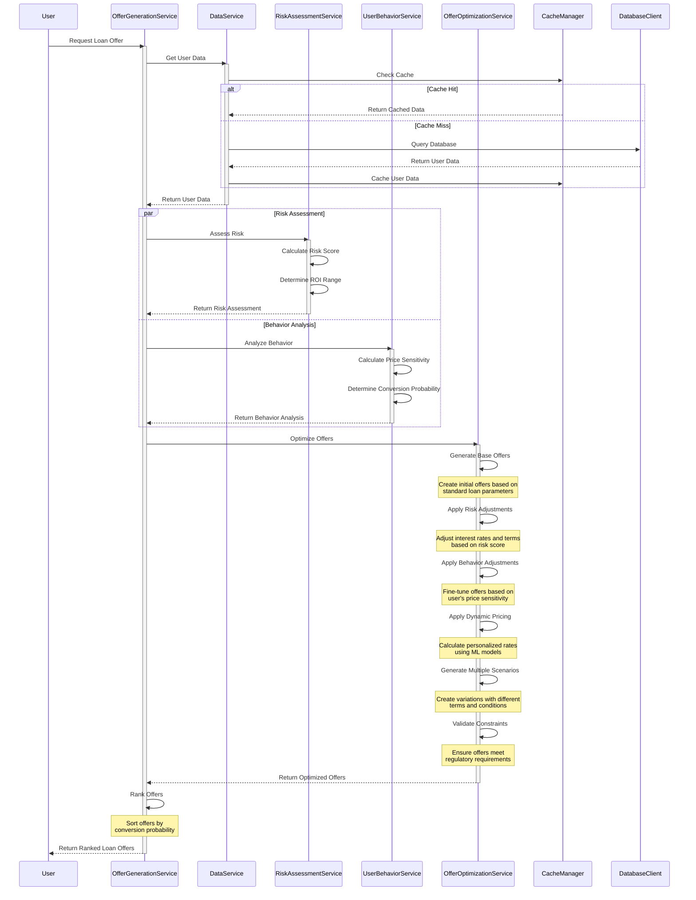

## Dynamic Offer Generation Process Details

### 1. Risk-Based Range Calculation
- Calculate initial interest rate range based on risk parameters:
  - Credit score
  - Income stability
  - Employment history
  - Existing debt-to-income ratio
  - Payment history
  - Collateral value (if applicable)
- Define minimum and maximum rates within regulatory constraints
- Establish risk bands and corresponding rate adjustments

### 2. Conversion Impact Matrix
The system maintains a sophisticated matrix that maps how changes in loan terms affect:
- Short-term conversion probability
- Long-term customer value
- Risk-adjusted return on investment (ROI)
- Customer lifetime value (CLV)

Key factors in the matrix include:
- Interest rate sensitivity
- Term length preferences
- Payment frequency options
- Early repayment penalties
- Additional service offerings

### 3. Term Optimization Process
When tweaking loan terms, the system ensures:
- Risk parameters remain within acceptable thresholds
- Conversion probability stays above minimum threshold
- Long-term value metrics are preserved
- Regulatory compliance is maintained
- Profitability targets are met

### 4. Dynamic Adjustment Factors
The system considers:
- Market conditions and competitor rates
- Time of year and seasonal factors
- User's historical behavior patterns
- Current economic indicators
- Portfolio balance and risk distribution

### 5. Offer Generation Constraints
- Minimum and maximum loan amounts
- Term length restrictions
- Rate caps and floors
- Regulatory requirements
- Risk tolerance thresholds
- Profitability margins

### 6. Final Offer Selection
- Rank offers based on:
  - Conversion probability
  - Risk-adjusted return
  - Customer lifetime value
  - Portfolio diversification
  - Market positioning
- Present top 3-5 offers to user
- Monitor offer performance for continuous improvement

##

## NOTE: Was unable to build a working service with the scope that we decided in the provided time frame. 