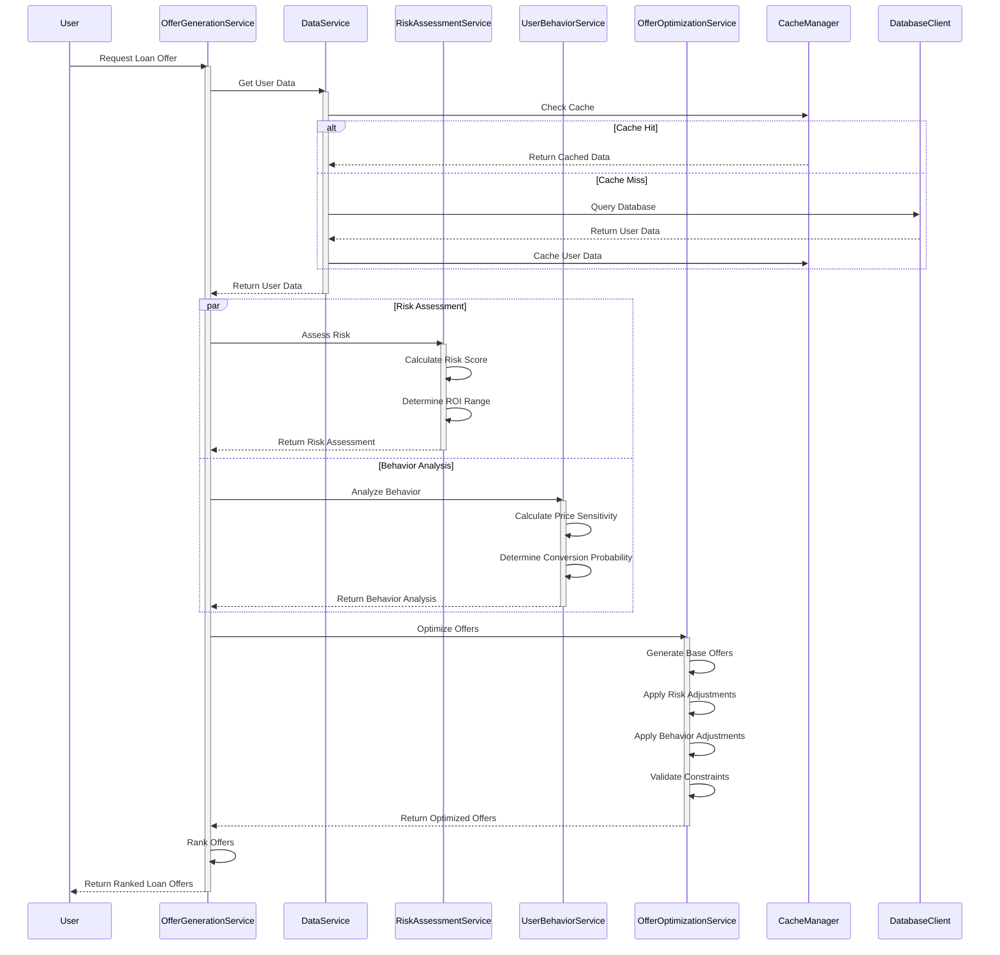

```mermaid
sequenceDiagram
    participant User
    participant OfferGenerationService
    participant DataService
    participant RiskAssessmentService
    participant UserBehaviorService
    participant OfferOptimizationService
    participant CacheManager
    participant DatabaseClient

    User->>OfferGenerationService: Request Loan Offer
    activate OfferGenerationService
    
    OfferGenerationService->>DataService: Get User Data
    activate DataService
    DataService->>CacheManager: Check Cache
    alt Cache Hit
        CacheManager-->>DataService: Return Cached Data
    else Cache Miss
        DataService->>DatabaseClient: Query Database
        DatabaseClient-->>DataService: Return User Data
        DataService->>CacheManager: Cache User Data
    end
    DataService-->>OfferGenerationService: Return User Data
    deactivate DataService

    par Risk Assessment
        OfferGenerationService->>RiskAssessmentService: Assess Risk
        activate RiskAssessmentService
        RiskAssessmentService->>RiskAssessmentService: Calculate Risk Score
        RiskAssessmentService->>RiskAssessmentService: Determine ROI Range
        RiskAssessmentService-->>OfferGenerationService: Return Risk Assessment
        deactivate RiskAssessmentService
    and Behavior Analysis
        OfferGenerationService->>UserBehaviorService: Analyze Behavior
        activate UserBehaviorService
        UserBehaviorService->>UserBehaviorService: Calculate Price Sensitivity
        UserBehaviorService->>UserBehaviorService: Determine Conversion Probability
        UserBehaviorService-->>OfferGenerationService: Return Behavior Analysis
        deactivate UserBehaviorService
    end

    OfferGenerationService->>OfferOptimizationService: Optimize Offers
    activate OfferOptimizationService
    OfferOptimizationService->>OfferOptimizationService: Generate Base Offers
    OfferOptimizationService->>OfferOptimizationService: Apply Risk Adjustments
    OfferOptimizationService->>OfferOptimizationService: Apply Behavior Adjustments
    OfferOptimizationService->>OfferOptimizationService: Validate Constraints
    OfferOptimizationService-->>OfferGenerationService: Return Optimized Offers
    deactivate OfferOptimizationService

    OfferGenerationService->>OfferGenerationService: Rank Offers
    OfferGenerationService-->>User: Return Ranked Loan Offers
    deactivate OfferGenerationService
``` 